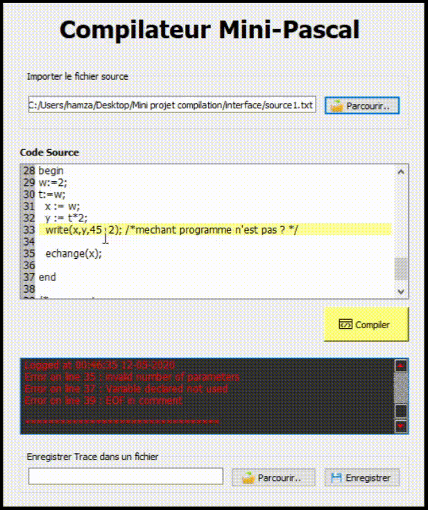

# mini_pascal_compiler

Le but de ce travail est de programmer en langage C (ou C++) un compilateur de codes sources programmés à l'aide d'un sous-ensemble du langage Pascal appelé Mini-Pascal.
Le processus de compilation d’un programme consiste en un certain nombre de phases; en pratique les compilateurs sont écrits pour être capables de les réaliser
ensemble, en faisant une seule passe dans sa donnée. Cependant, on va présenter ces phases séparément pour mieux comprendre le rôle de chacune de celles-ci.
Les quatres grandes phases:
1. L’analyse lexicale
2. L’analyse syntaxique
3. L’analyse sémantique
4. La production du code objet

